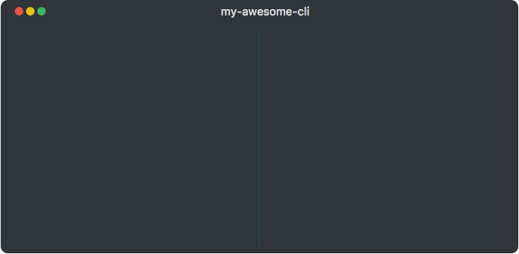

# kumquat 🍊 
A web showcase for your terminal apps 

## Getting Started

**Install**

Install using your package manager of choice:

    $ bower install kumquat --save
        or 
    $ npm install kumquat --save
        or 
    $ yarn add kumquat
        
**Include in your project**

Include `dist/kumquat.js` and `dist/kumquat.css`

    <link rel="stylesheet" href="bower_components/kumquat/dist/kumquat.css">
    
    
Open your browser, you'll be greeted by your kumquat instance:

**Change its contents using the programmatic API**

For example:

    

## Contributing

Please read [CONTRIBUTING.md](CONTRIBUTING.md) for details on the code of conduct, and the
process for submitting pull requests.

## Versioning

`kumquat` uses [SemVer](http://semver.org/) for versioning. For the versions available, see the
[tags on this repository](https://github.com/israelroldan/kumquat/tags). 

## Authors

- **Israel Roldan** - Author [israelroldan](https://github.com/israelroldan)

## License
This project is licensed under the MIT License - see the [LICENSE](LICENSE) file for details